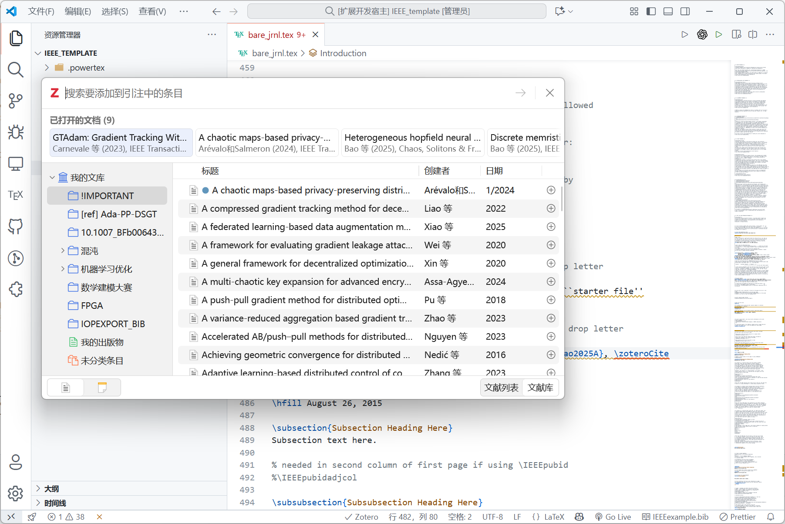
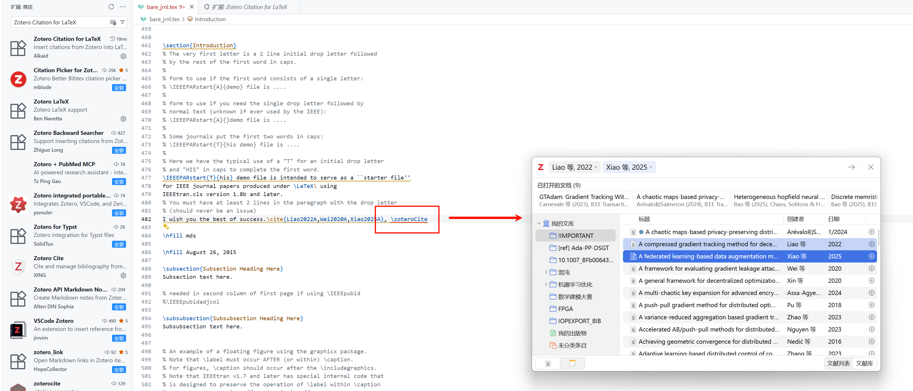
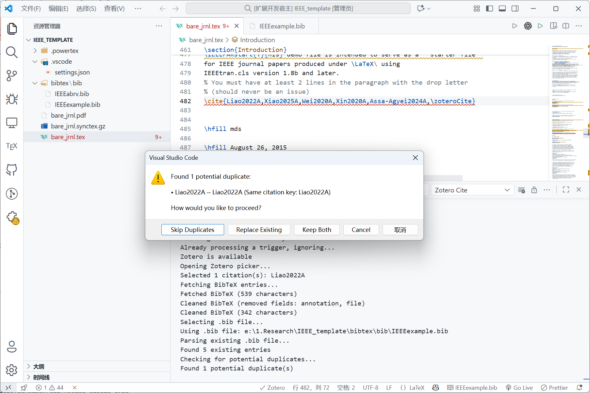

# Zotero Citation for LaTeX

A Visual Studio Code extension that brings Zotero's powerful citation management directly into your LaTeX workflow. Insert citations from your Zotero library with a simple command, and let the extension handle BibTeX file management automatically with intelligent duplicate detection.


<!-- GIF: Show typing \zoteroCite, picker opening, selecting references, duplicate detection, and automatic insertion -->

## ✨ Features

### 🎯 Smart Citation Insertion
- **Code Completion**: Type `\zoteroCite` and get IntelliSense suggestions
- **Automatic Trigger**: Complete the command to instantly open Zotero's native picker
- **Multiple Citations**: Select one or multiple references at once
- **Smart Appending**: Automatically detects if you're inside an existing `\cite{}` and appends keys instead of creating nested commands
- **Auto-Cleanup**: Removes `\zoteroCite` trigger if you cancel the picker


<!-- GIF: Show typing \zoteroCite with autocomplete, then citation being inserted -->

### 📚 BibTeX Management
- **Auto-Fetch**: Retrieves BibTeX entries directly from Zotero via Better BibTeX
- **Intelligent Duplicate Detection**: Multi-dimensional duplicate detection before insertion
  - Citation key matching
  - DOI matching
  - Title similarity (>85%)
  - Author + Year combination (>80%)
- **User Control**: Choose how to handle duplicates (skip, replace, or keep both)
- **Clean Entries**: Automatically removes unwanted fields (annotation, file, etc.) from BibTeX entries
- **Configurable Cleaning**: Customize which fields to remove via settings
- **Robust Export**: Handles invalid citation keys gracefully, skipping problematic entries

### 🔍 Intelligent Duplicate Detection
- **Automatic Check**: Scans for duplicates before every insertion
- **Multi-Dimensional Analysis**:
  - Exact citation key match
  - DOI comparison (case-insensitive)
  - Title similarity using Levenshtein distance
  - Author + Year combination matching
- **Interactive Dialog**: Choose how to handle detected duplicates
  - Skip duplicates (add only new entries)
  - Replace existing (update with new versions)
  - Keep both (allow duplicates)
  - Cancel operation
- **Manual Scan**: Run duplicate detection on entire .bib file anytime


<!-- GIF: Show duplicate detection dialog with options -->

### 🎛️ Status Bar Integration
- **Connection Monitor**: Real-time Zotero connection status indicator
  - ✓ Green check when connected
  - ✗ Red X when disconnected
  - Auto-checks every 10 seconds
  - Prevents concurrent API calls
- **Quick .bib Selection**: Click to select your target bibliography file
  - Shows current file name
  - One-click file switching
  - Option to save as default


<!-- GIF: Show status bar indicators, clicking to select .bib file, connection status changing -->

### 🔧 Smart Features
- **Inside `\cite{}` Detection**: Type `\zoteroCite` inside an existing `\cite{key1}` and it will append new keys: `\cite{key1,key2,key3}`
- **Workspace Integration**: Supports workspace-relative paths for `.bib` files
- **Error Handling**: Clear, user-friendly error messages in Chinese and English
- **Process Lock**: Prevents trigger loops and concurrent operations

## 📋 Requirements

- **[Zotero](https://www.zotero.org/)** desktop application (must be running)
- **[Better BibTeX](https://retorque.re/zotero-better-bibtex/)** plugin for Zotero
  - Provides JSON-RPC API for citation export
  - Generates clean, consistent citation keys

## 🚀 Installation

1. Install the extension from VS Code Marketplace (or install `.vsix` manually)
2. Install and start Zotero desktop application
3. Install Better BibTeX plugin in Zotero:
   - Download from [Better BibTeX releases](https://github.com/retorquere/zotero-better-bibtex/releases)
   - In Zotero: Tools → Add-ons → Install Add-on From File
4. Open your LaTeX project in VS Code

## 📖 Usage

### Basic Citation Insertion

1. Open a `.tex` file in VS Code
2. Type `\zoteroCite` where you want to insert a citation
   - Use autocomplete (Ctrl+Space) for suggestions
3. The Zotero picker opens automatically
4. Select one or more references from your library
5. Choose your `.bib` file (first time only, or click status bar to change)
6. **Review duplicate detection results** (if any duplicates found)
7. Done! The extension:
   - Checks for duplicates and lets you decide how to handle them
   - Fetches BibTeX entries from Zotero
   - Appends new entries to your `.bib` file (based on your choice)
   - Replaces `\zoteroCite` with `\cite{key1,key2,...}`

### Handling Duplicates

When duplicates are detected, you'll see a dialog with options:

- **Skip Duplicates**: Only add entries that don't already exist
- **Replace Existing**: Update existing entries with new versions from Zotero
- **Keep Both**: Add all entries, even if they're duplicates
- **Cancel**: Abort the operation

The extension detects duplicates using:
- Exact citation key match
- DOI comparison
- Title similarity (>85% match)
- Author + Year combination (>80% match)

### Adding to Existing Citations

If you want to add more references to an existing `\cite{}`:

```latex
% Before
\cite{smith2020}

% Type \zoteroCite inside the braces
\cite{smith2020\zoteroCite}

% After selecting new references
\cite{smith2020,jones2021,brown2022}
```

### Detecting Duplicates in Existing .bib File

Run the command `Zotero Cite: Detect Duplicates in .bib File` to scan your entire bibliography for potential duplicates. The extension will:
1. Parse all entries in the file
2. Compare each entry against all others
3. Report duplicates in the Output panel
4. Show a summary notification

### Status Bar Features

**Zotero Connection Status** (right side of status bar):
- Click to manually refresh connection
- Shows tooltip with connection details
- Automatically prevents concurrent API calls

**BibTeX File Selector** (right side of status bar):
- Shows current `.bib` file name
- Click to select a different file
- Option to save selection as workspace default

## ⚙️ Extension Settings

Configure the extension via VS Code settings (`Ctrl+,`):

| Setting | Description | Default |
|---------|-------------|---------|
| `zotero-cite.defaultBibFile` | Default .bib file path (absolute or workspace-relative) | `null` |
| `zotero-cite.autoAppend` | Automatically append BibTeX entries to .bib file | `true` |
| `zotero-cite.removeFields` | BibTeX fields to remove from entries | `["annotation", "file"]` |

### Example Configuration

```json
{
  "zotero-cite.defaultBibFile": "references.bib",
  "zotero-cite.autoAppend": true,
  "zotero-cite.removeFields": [
    "annotation",
    "file",
    "abstract",
    "keywords"
  ]
}
```

## 🎯 Commands

Access via Command Palette (`Ctrl+Shift+P`):

- `Zotero Cite: Trigger Manually` - Manually trigger citation picker
- `Zotero Cite: Select BibTeX File` - Choose target .bib file
- `Zotero Cite: Check Connection` - Test Zotero connection
- `Zotero Cite: Detect Duplicates in .bib File` - Scan for duplicates in current .bib file

## 🐛 Troubleshooting

### Zotero Not Connected
- Ensure Zotero desktop application is running
- Check that Better BibTeX plugin is installed and enabled
- Try clicking the Zotero status indicator to refresh connection

### Picker Already Running Error
- Close any open Zotero picker windows in other applications
- The extension prevents concurrent picker usage to avoid conflicts

### Citations Not Inserting
- Check the Output panel (View → Output → "Zotero Cite") for detailed logs
- Verify your `.bib` file is writable
- Ensure you have selected a valid `.bib` file

### Invalid Citation Keys
- Some entries may have invalid or incomplete citation keys
- The extension will skip problematic entries and continue with valid ones
- Check the Output panel for warnings about skipped entries

### Duplicate Detection Issues
- If duplicates aren't detected, check that entries have proper fields (title, DOI, author, year)
- Title matching requires >85% similarity
- Author+Year matching requires >80% similarity

## 🔄 How It Works

1. **Trigger Detection**: Monitors text changes for `\zoteroCite` command
2. **Connection Check**: Verifies Zotero is running via Better BibTeX JSON-RPC API
3. **Picker Invocation**: Opens Zotero's native CAYW (Cite As You Write) picker
4. **BibTeX Export**: Fetches entries using Better BibTeX export format
5. **Entry Cleaning**: Removes unwanted fields based on configuration
6. **Duplicate Detection**: Analyzes new entries against existing ones using multiple dimensions
7. **User Decision**: Prompts user to choose how to handle duplicates
8. **File Update**: Appends/replaces entries in `.bib` file based on user choice
9. **Citation Insertion**: Replaces trigger with `\cite{keys}` or appends to existing citation

## 🤝 Contributing

Contributions are welcome! Please feel free to submit issues or pull requests.

## 📝 Release Notes

### 0.1.0 (Initial Release)

- ✅ Basic citation insertion with `\zoteroCite` trigger
- ✅ Zotero picker integration via Better BibTeX
- ✅ Automatic BibTeX file management
- ✅ Status bar indicators for connection and .bib file
- ✅ Smart citation appending (detects existing `\cite{}`)
- ✅ Configurable BibTeX field cleaning
- ✅ Code completion for `\zoteroCite` command


### 0.1.0 (Intelligent Duplicate Detection)
- ✅ Intelligent duplicate detection (citation key, DOI, title, author+year)
- ✅ User-controlled duplicate handling (skip, replace, keep both)
- ✅ Manual duplicate scan command
- ✅ Robust error handling for invalid citation keys
- ✅ Auto-cleanup of trigger on cancellation
- ✅ Concurrent operation prevention

## 📄 License

MIT License - see LICENSE file for details

---

**Enjoy seamless Zotero integration in VS Code!** 🎉

If you find this extension helpful, please consider leaving a review on the marketplace.
